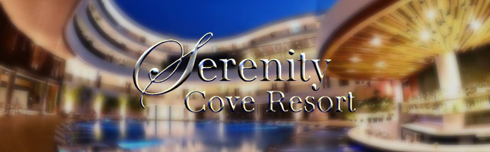
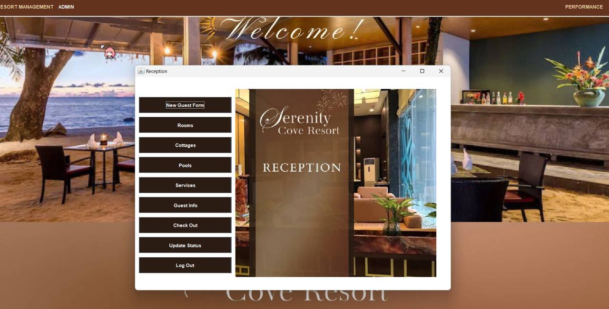
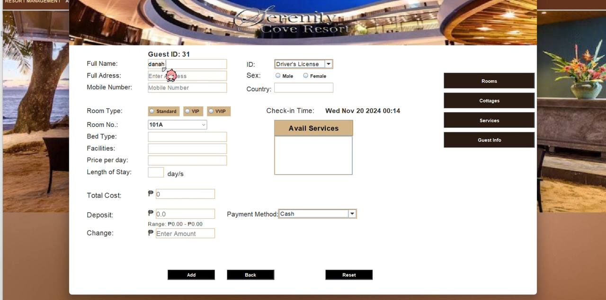
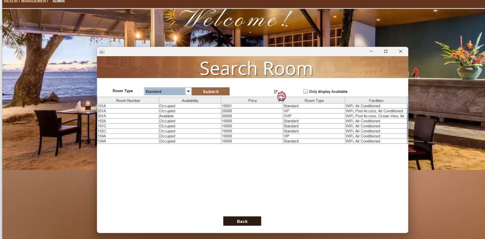
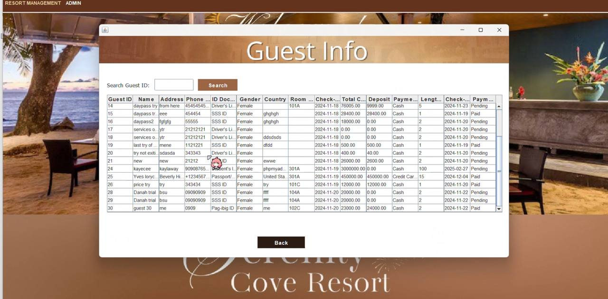
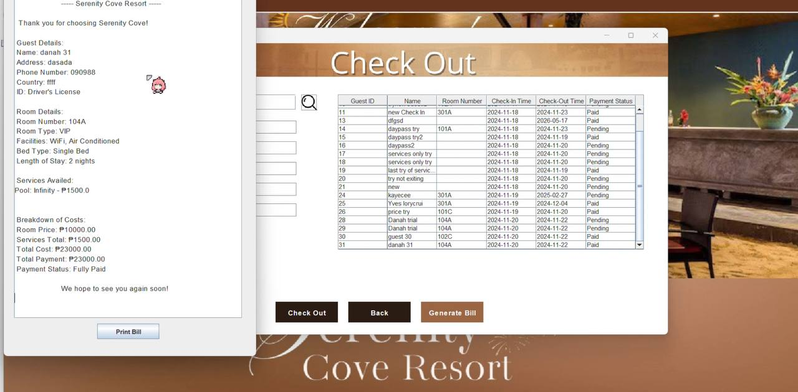
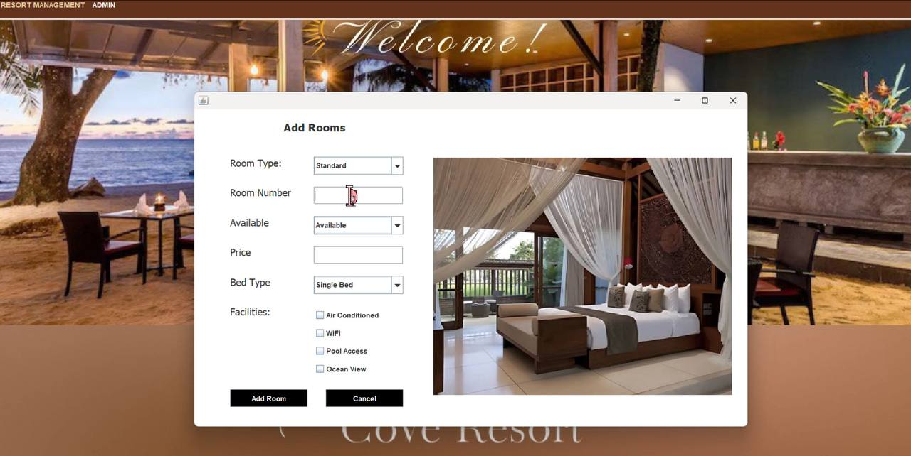
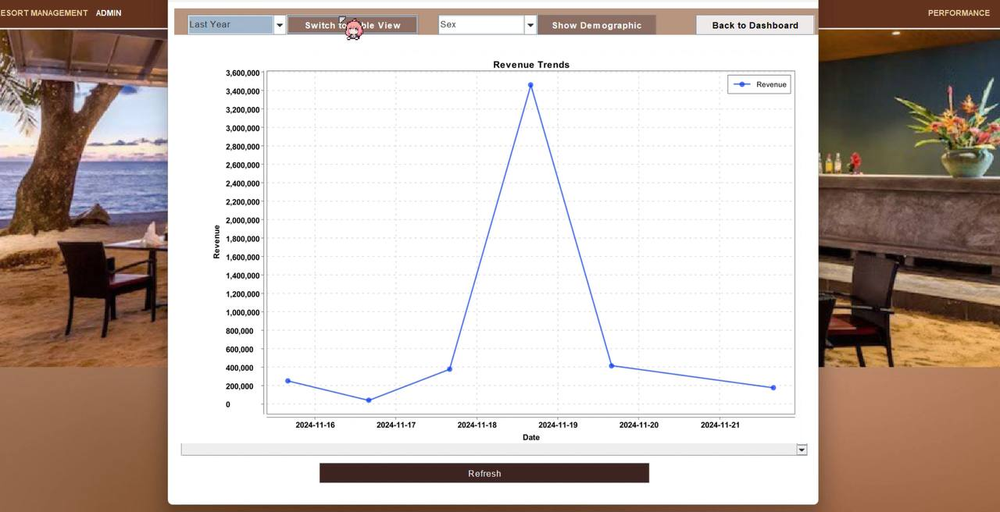
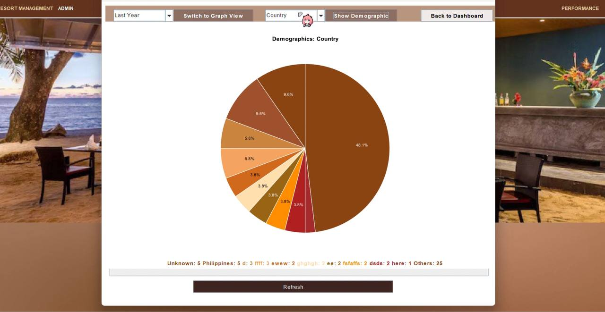
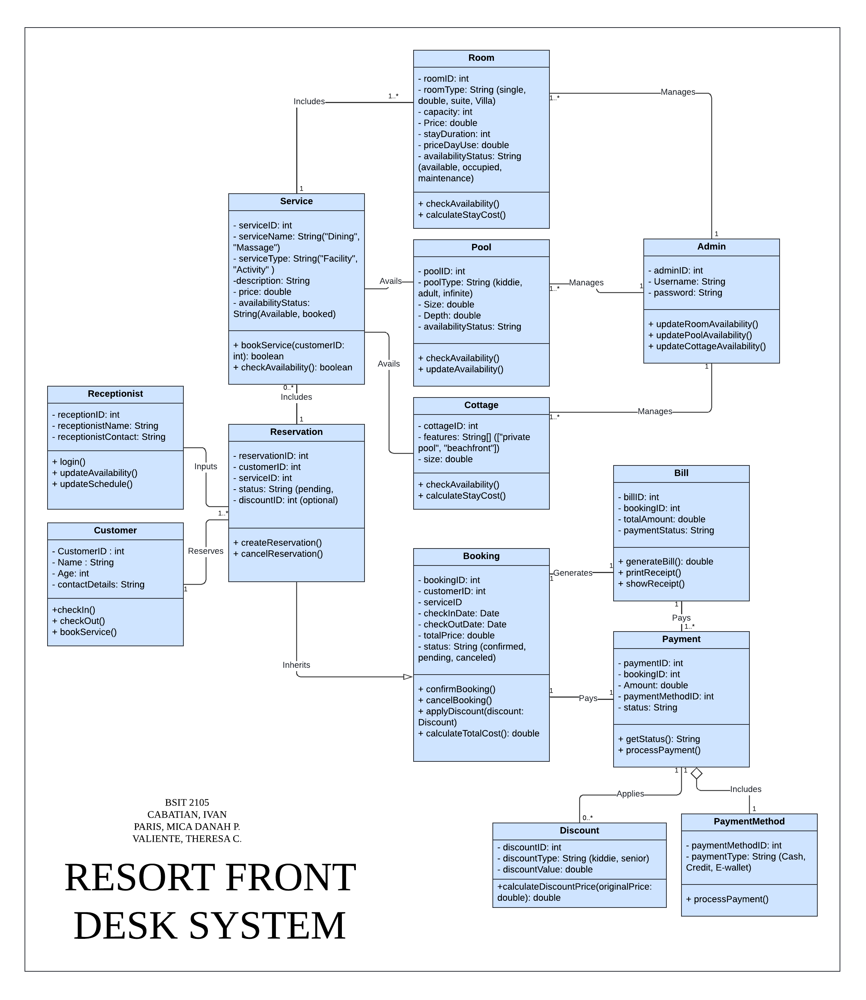

  
  

#  Serenity Cove – Resort Management System

A full-featured **Java Swing** application built to manage resort operations, bookings, and guest data for **Serenity Cove**. Designed for front desk receptionists and admins, the system handles guest check-ins, service availing, billing, and visual analytics.

---

## 📑 Table of Contents

- [🧠 Overview](#-overview)
- [🎯 Objectives](#-objectives)
- [🛠️ Tech Stack](#-tech-stack)
- [🗂️ System Features](#-system-features)
- [📸 Screenshots](#-screenshots)
- [📊 ERD & System Flow](#-erd--system-flow)
- [🧪 How to Run](#-how-to-run)
- [📬 Project Members](#-project-members)
- [📄 License](#-license)

---

## 🧠 Overview

**Serenity Cove Resort Management System** is a desktop-based system built with **Java Swing** to streamline front desk operations. It includes a user-friendly reception dashboard for real-time guest management, a robust admin backend for monitoring resort performance, and support for booking rooms, cottages, pools, and additional services.

---

## 🎯 Objectives

- Manage guest bookings for rooms, cottages, and services  
- Automate price computation based on room type, stay duration, and availed amenities  
- Allow dynamic fetching of available rooms and their facilities based on type  
- Accept deposits (minimum 10%) and calculate remaining balances  
- Provide checkout functionality with auto-generated printable receipts  
- Offer real-time insights via charts for revenue, guest demographics, and resort popularity  
- Ensure accurate tracking of guest status: **Checked In**, **Checked Out**, **Unpaid**, **Extended Stay**

---

## 🛠️ Tech Stack

| Tech           | Usage                                  |
|----------------|------------------------------------------|
| **Java Swing** | GUI components and logic                |
| **MySQL**      | Database storage                        |
| **AWT Print API** | Receipt printing                      |
| **XChart**     | Analytics & resort performance graphs   |

---

## 🗂️ System Features

### 🧾 Reception Dashboard (Front Desk)

- View room list, cottages, pools, and services  
- Add new guest via Guest Form  
- View guest list and update guest status  
- Process deposit, compute total bill & change  
- Check out guests (only when fully paid)  
- Generate and print bill receipt  
- Log out of system

### 🏨 Guest Form

- Select room **type**: Standard, VIP, or VVIP  
- Auto-fetch matching rooms and display **bed type, price, and facilities**  
- Input number of days to dynamically compute total  
- Add cottages, pools, and services to booking  
- Accept deposit (10% minimum), and calculate remaining balance and change  

### 📈 Admin Dashboard

- Add rooms (bed size, facilities, price), cottages, pools, and services  
- View performance charts (via **XChart**) for:
  - Revenue trends  
  - Demographic analytics (by country, sex)  
  - Popular room types and services  
- Manage guest records, update payment status, and control access

---

## 📸 Screenshots

Click to view screenshots

  
  

  
  

  
  

  
  

  
  

---

##  UML Diagram

Click to view UML

 

  

---

## 📄 License

This project was developed as part of a BSIT academic requirement at BatStateU.  
Feel free to explore and use this code for learning purposes, and please give proper credit when reusing any part of it.

